# Proyecto Sistemas Distribuidos 2024-2025

## Integrantes

| Nombre                     | Email                              | GitHub                                  |
|----------------------------|------------------------------------|-----------------------------------------|
| Javier Castellanos Serrano | j.castellanos.2018@alumnos.urjc.es | [GitHub](https://github.com/Javicastes) |
| María Martín Mullor        | m.martinmul.2021@alumnos.urjc.es   | [GitHub](https://github.com/maria-marmul) |
| Verónica Ramírez Marín     | v.ramirez.2021@alumnos.urjc.es     | [GitHub](https://github.com/VeroRam1)   |
| Wenhao Zhang               | w.zhang.2022@alumnos.urjc.es       | [GitHub](https://github.com/wenhiii)    |


## Navegación

### Capturas de Pantalla

1. **Página Principal**
- *Pantalla de presentación desde donde puede comenzar a navegar el usuario, haciendo click en las categorías para ver productos filtrados, pulsando en el carrito o en el desplegable.*
  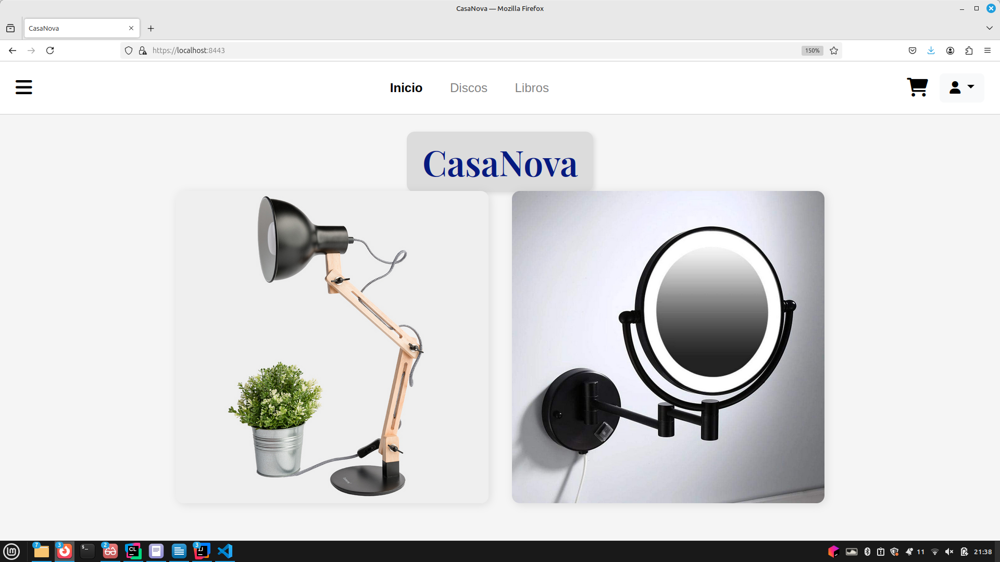

2. **Administración de Usuarios**
- *Desde aquí podemos añadir o eliminar usuarios, y ver los usuarios existentes.*
  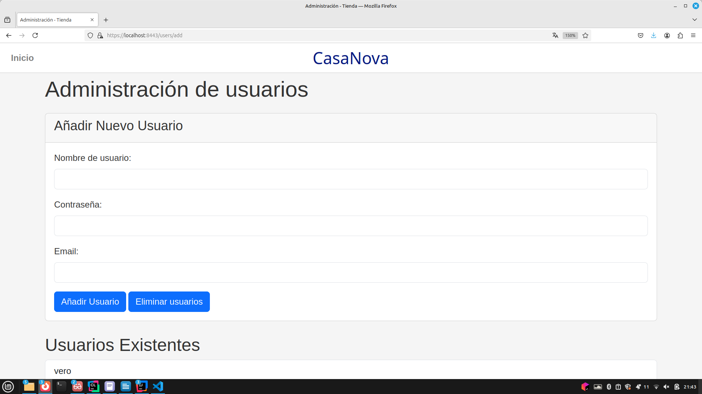

3. **Lista de Usuarios**
- *Página para ver la lista de usuarios, donde podremos eliminar a algún usuario de la lista o pulsar el botón de Añadir usuarios  para añadir uno nuevo.*
  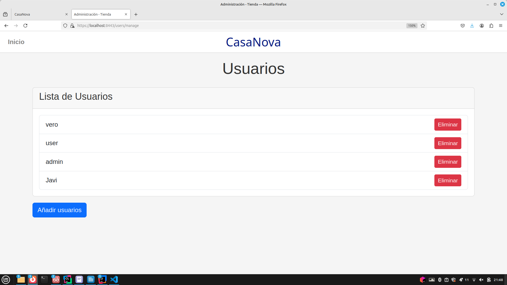

4. **Administración de Productos**
- *Aquí podemos añadir productos nuevos, ver los productos o modificarlos.*
  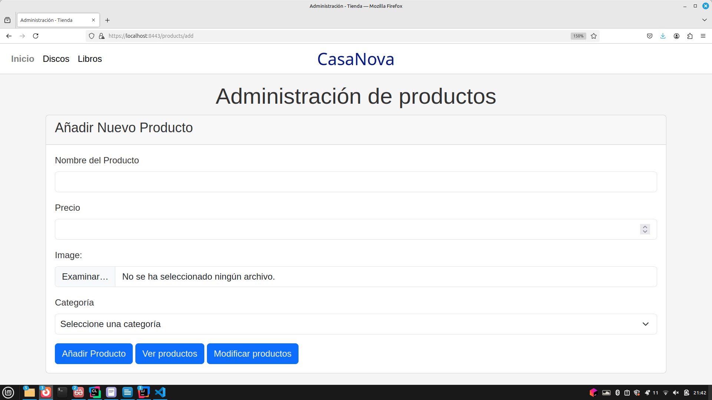

5. **Productos disponibles**
- *En esta página podemos ver los productos disponibles, que aparecen con una imagen, el nombre y el precio. Podemos añadirlos al carrito.*
  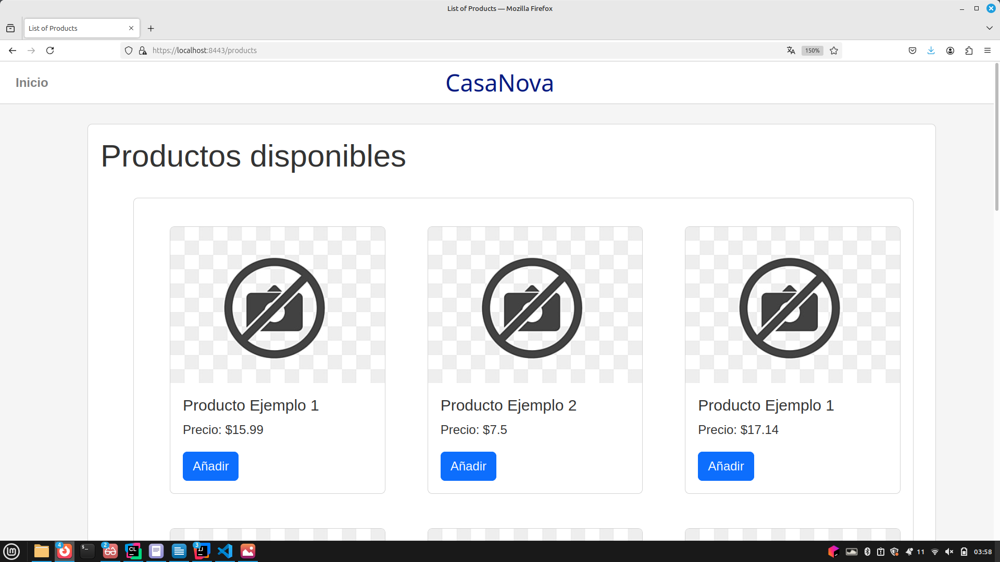

6. **Lista de Productos**
- *Página para ver la lista de productos de nuestra web, desde donde podremos modificarlos o eliminarlos si nos interesa.*
  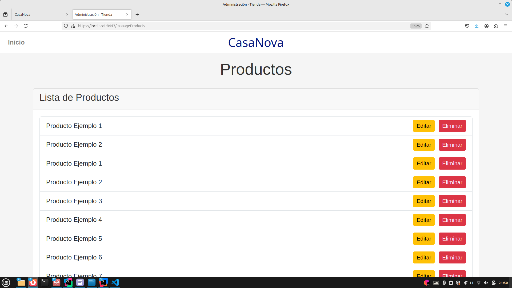

7. **Editar Producto**
- *Desde aquí podemos editar cualquier producto que hayamos seleccionado: su nombre, el precio y la categoría a la que pertenecen.*
  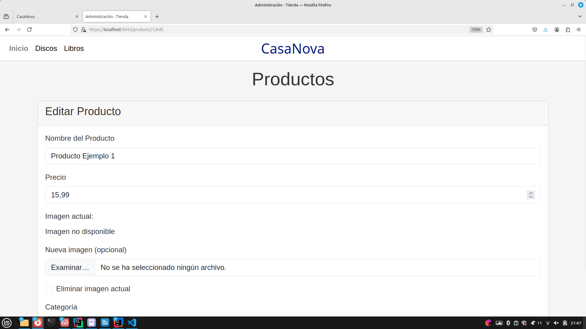

8. **Ver Productos en Categoría Discos**
- *Podemos ver los productos de la categoría Discos.*
  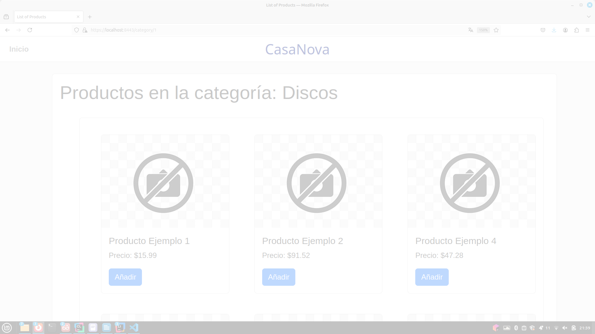

9. **Ver Productos en Categoría Libros**
- *Podemos ver los productos de la categoría Libros.*
  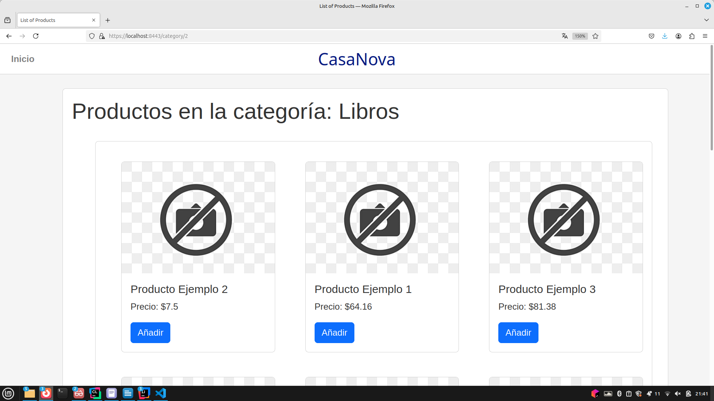

10. **Administración de Categorías**
- *Página para añadir categorías nuevas, desde donde también podemos ver o modificar las categorías existentes.*
  

11. **Lista de Categorías**
- *Página para eliminar categorías.*
  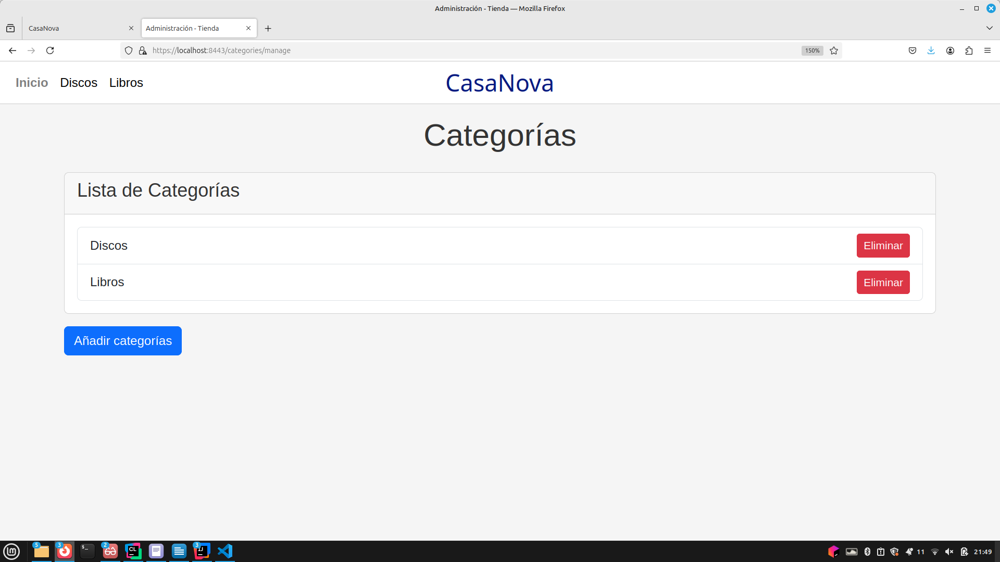

12. **Pedido**
- *En esta página podemos ver todos nuestros pedidos.*
  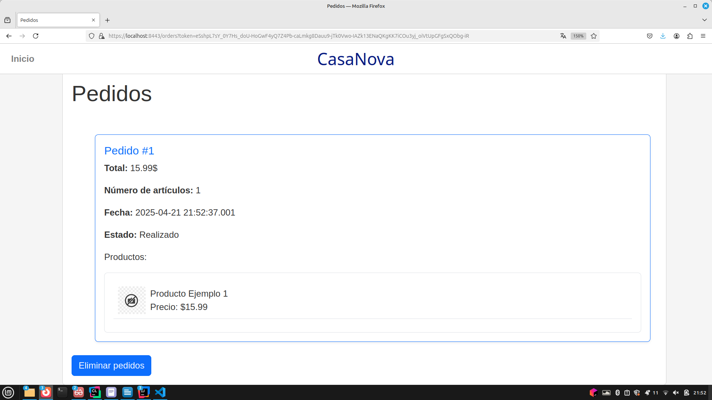

13. **Lista de Pedidos**
- *En esta página podemos eliminar nuestros pedidos.*
  

14. **Carrito**
- *Página del carrito de la compra, desde donde podremos finalizar la compra o seguir comprando.*
  

15. **Finalizar Compra**
- *Aviso que salta al finalizar la compra.*
  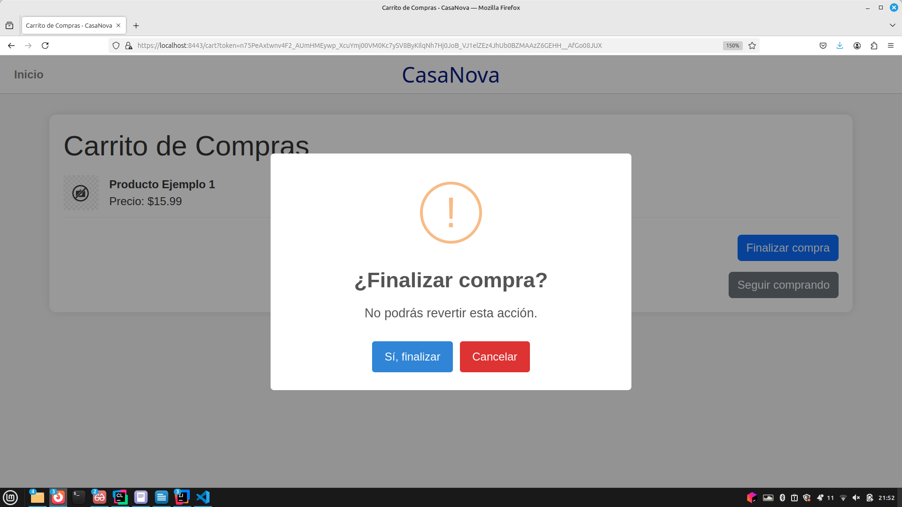

16. **Mi Perfil**
- *Página de perfil, donde podremos ver los datos de nuestro perfil.*
  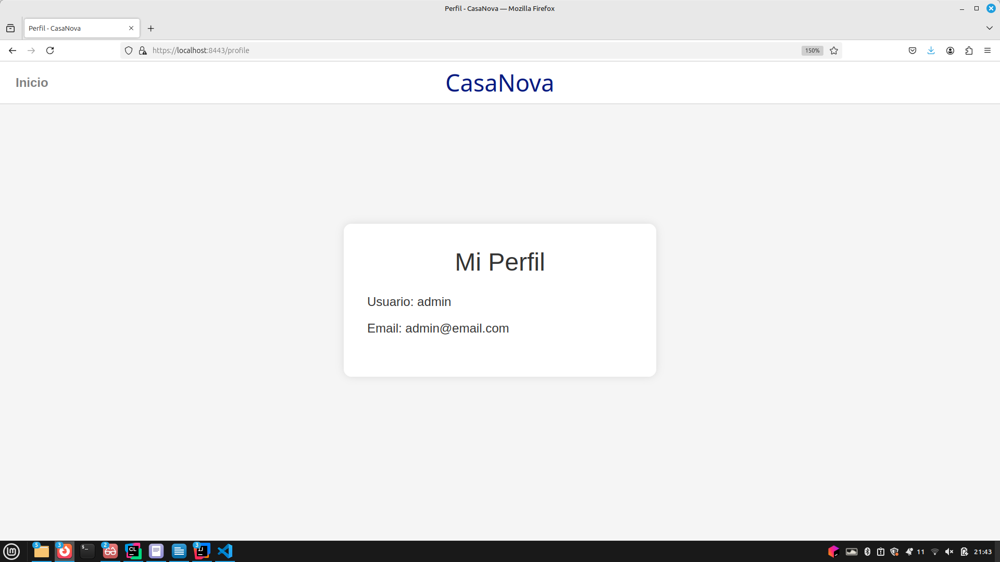

17. **Inicio de Sesión**
- *Página de inicio de sesión.*
  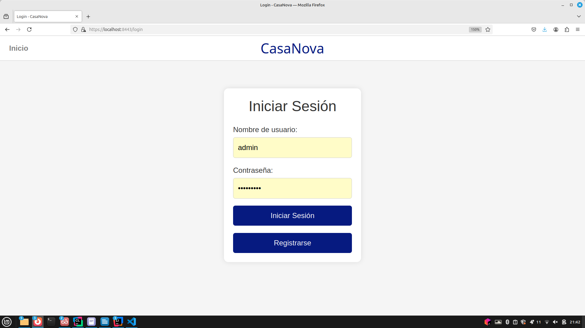

18. **Registrarse**
- *Página de registro.*
  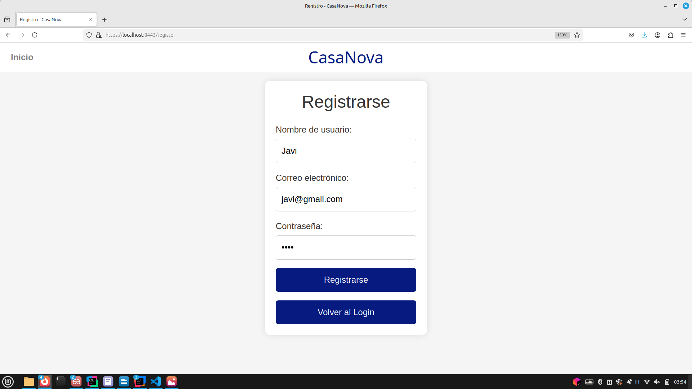

19. **Página de Error**
- *Página de error, al tratarse de una operación indebida o excepción.*
  

### Diagrama de Navegación

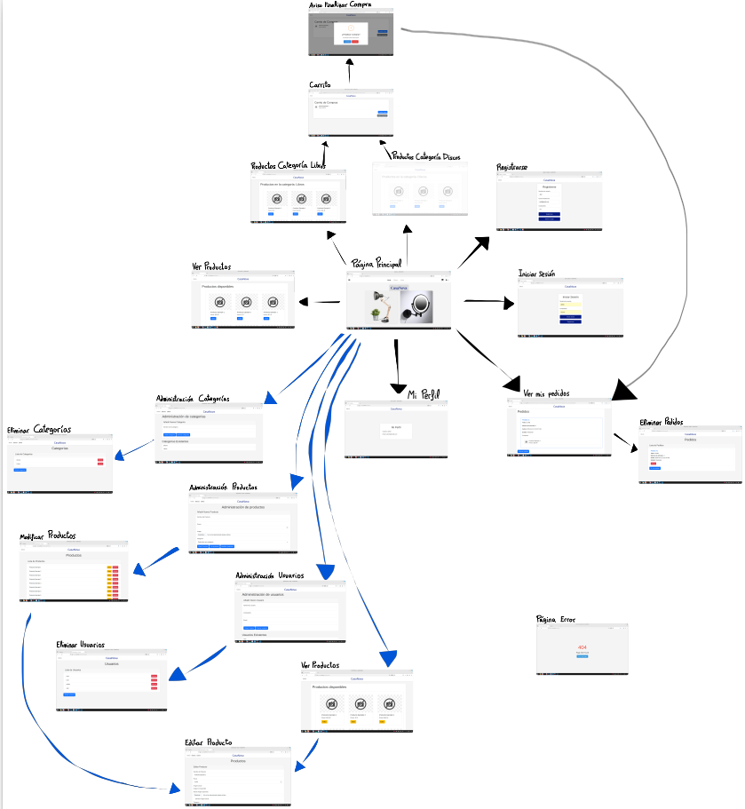

## Instrucciones de Ejecución

### Requisitos
- Java 17
- MySQL 8.0.32
- Maven 3.8.1

### Pasos para Descargar, Construir y Ejecutar la Aplicación

1. **Clonar el repositorio**:
   ```sh
   https://github.com/SSDD-2025/practica-sistemas-distribuidos-2025-grupo-10.git
   cd cd practica-sistemas-distribuidos-2025-grupo-10
   ```

2. **Configurar la base de datos MySQL**:
    - Crear una base de datos en MySQL:
      ```sql
      CREATE DATABASE shop;
      ```
    - Actualizar las credenciales de la base de datos en `src/main/resources/application.properties`:
      ```properties
      spring.datasource.url=jdbc:mysql://localhost:3306/shop
      # Tanto el usuario como la contraseña difiere según lo configurado en cada máquina
      spring.datasource.username=root
      spring.datasource.password=88888888
      ```

3. **Construir la aplicación**:
    - Descarga las dependencias necesarias (Asegúrese de tener MVN instalado).
   ```sh
   mvn clean install
   ```
    - En caso de IDEs como IntelliJ o Eclipse, resolverán las dependencias por sí solas a partir del pom.xml.

4. **Ejecutar la aplicación**:
    - Como altenativa puede ejecutar `Demo1Application.java`.
   ```sh
   mvn spring-boot:run
   ```

## Diagrama UML de las Clases Java

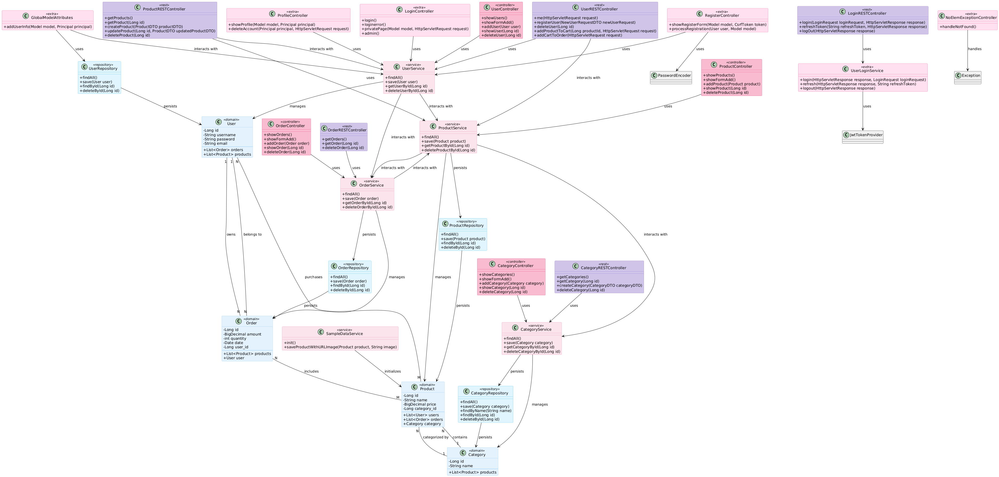

## Diagrama de Clases y Templates

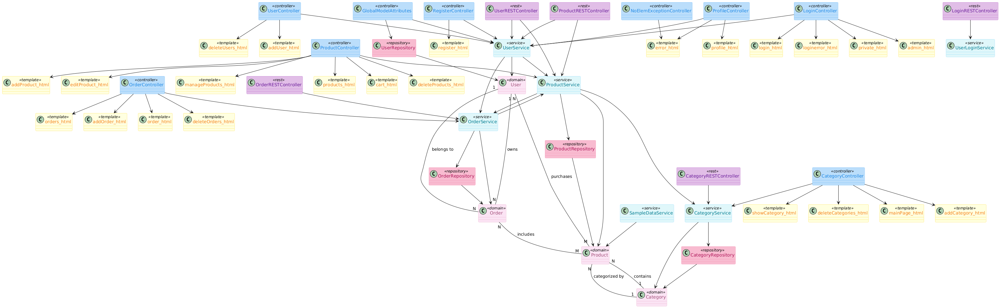


### Estructura del Proyecto

#### Controladores
- **UserController**: Maneja las solicitudes relacionadas con los usuarios.
- **CategoryController**: Maneja las solicitudes relacionadas con las categorías.
- **OrderController**: Maneja las solicitudes relacionadas con los pedidos.
- **ProductController**: Maneja las solicitudes relacionadas con los productos.
- **GlobalModelAttributes**: Atributos globales para los templates.
- **LoginController**: Controlador de vistas de login.
- **NoElemExceptionController**: Manejo global de excepciones.
- **ProfileController**: Vista de perfil y eliminación de cuenta.
- **RegisterController**: Registro de nuevos usuarios.

### Controladores REST
- **CategoryRESTController**: API REST de categorías.
- **LoginRESTController**: API de login con JWT.
- **OrderRESTController**: API REST de pedidos.
- **ProductRESTController**: API REST de productos.
- **UserRESTController**: API REST de usuarios.

#### Servicios
- **UserService**: Proporciona operaciones CRUD para los usuarios.
- **CategoryService**: Proporciona operaciones CRUD para las categorías.
- **OrderService**: Proporciona operaciones CRUD para los pedidos.
- **ProductService**: Proporciona operaciones CRUD para los productos.
- **SampleDataService**: Inicializa datos de muestra en la base de datos.
- **ImageUtils**: Utilidades para imágenes.

#### Repositorios
- **UserRepository**: Interfaz para las operaciones CRUD en la entidad `User`.
- **CategoryRepository**: Interfaz para las operaciones CRUD en la entidad `Category`.
- **OrderRepository**: Interfaz para las operaciones CRUD en la entidad `Order`.
- **ProductRepository**: Interfaz para las operaciones CRUD en la entidad `Product`.

#### Entidades
- **User**: Representa a un usuario en el sistema.
- **Category**: Representa una categoría de productos.
- **Order**: Representa un pedido realizado por un usuario.
- **Product**: Representa un producto en el sistema.

### DTOs y Mappers
- DTOs: `UserDTO`, `ProductDTO`, `OrderDTO`, `CategoryDTO`, `NewProductRequestDTO`
- Mappers: `UserMapper`, `ProductMapper`, `OrderMapper`, `CategoryMapper`

### Seguridad
- **SecurityConfiguration**: Configuración global de Spring Security.
- **RepositoryUserDetailsService**: Implementación de `UserDetailsService`.
- **CSRFHandlerConfiguration / CSRFHandlerInterceptor**: Configuración y manejo de CSRF.

### JWT
- `AuthResponse`, `LoginRequest`, `JwtRequestFilter`, `JwtTokenProvider`
- `TokenType`, `UnauthorizedHandlerJwt`, `UserLoginService`

#### Relaciones entre entidades
- Una categoría contiene **N** productos
- Un producto sólo pertenece a **1** categoría
- **N** usuarios puede tener **M** productos en el carrito
- Un usuario puede tener **N** pedidos
- Un pedido solo pertenece a **1** usuario
- **N** productos pertenecen a **M** pedidos

### Plantillas HTML
- **addCategory.html**: Formulario para añadir una nueva categoría.
- **addProduct.html**: Formulario para añadir un nuevo producto.
- **addUser.html**: Formulario para añadir un nuevo usuario.
- **editProduct.html**: Formulario para editar un producto existente.
- **error.html**: Página de error.
- **index.html**: Página principal.
- **mainPage.html**: Página principal de la aplicación.
- **manageProducts.html**: Página para gestionar productos.
- **products.html**: Muestra la lista de productos.
- **showProduct.html**: Muestra los detalles de un producto.
- **admin.html**: Página exclusiva para usuarios con rol administrador.
- **cart.html**: Muestra el carrito de la compra con los productos añadidos por el usuario.
- **deleteCategories.html**: Página para seleccionar y eliminar categorías.
- **deleteOrders.html**: Página para seleccionar y eliminar pedidos.
- **deleteProducts.html**: Página para seleccionar y eliminar productos.
- **deleteUsers.html**: Página para seleccionar y eliminar usuarios.
- **login.html**: Formulario de inicio de sesión.
- **loginerror.html**: Muestra un mensaje de error al fallar el inicio de sesión.
- **orders.html**: Muestra la lista de pedidos realizados por el usuario.
- **order.html**: Muestra los detalles de un pedido específico.
- **private.html**: Página de acceso privado para usuarios autenticados.
- **productsByCategories.html**: Muestra los productos filtrados por categoría.
- **profile.html**: Muestra la información del perfil del usuario.
- **register.html**: Formulario de registro para nuevos usuarios.

### Configuración de la Base de Datos
- **application.properties**: Contiene la configuración de la base de datos MySQL.

```properties
spring.application.name=demo1
server.port = 8443
server.ssl.key-store = src/main/resources/keystore.jks
server.ssl.key-store-password = secret
server.ssl.key-password = secret

#Mustache configuration
spring.mustache.suffix=.html
spring.mustache.prefix=classpath:/templates/

# MySQL
spring.datasource.url=jdbc:mysql://localhost:3306/shop
spring.datasource.username=root
Password depends on your personal computer database configuration
spring.datasource.password=88888888
spring.datasource.driver-class-name=com.mysql.cj.jdbc.Driver
JPA and hibernate configuration
spring.jpa.database-platform=org.hibernate.dialect.MySQL8Dialect

spring.jpa.hibernate.ddl-auto=update
spring.jpa.show-sql=true
spring.jpa.properties.hibernate.format_sql=true

spring.jpa.properties.hibernate.globally_quoted_identifiers=true

spring.servlet.multipart.max-file-size=10MB
spring.servlet.multipart.max-request-size=10MB


# SQL logging
logging.level.org.hibernate.SQL=DEBUG
logging.level.org.hibernate.type.descriptor.sql.BasicBinder=TRACE

#Admin credentials
admin.username=admin
#admin password is adminpass
admin.password=$2a$12$62SMakJh7Lj2U5cHe2G0m.0uOT3rx7tafzx4o8vnqm7tzlDopL6s2

```

## Participación

### Javier Castellanos
- **Tareas**: Colaboración en el desarrollo del UserController para gestionar usuarios mediante operaciones CRUD. Incorporación de una ruta GET en el UserController para servir la vista addUser.html, facilitando la incorporación de nuevos usuarios al sistema. Implementación de los métodos save en UserService y CategoryService para garantizar la persistencia de los datos en la base de datos. Realización del README.md.
- **5 commits más significativos**:
    1. [Commit 1](https://github.com/SSDD-2025/practica-sistemas-distribuidos-2025-grupo-10/commit/5dd21b20343fcaf1e37d8f953e5b0f0642a57fc4)
    2. [Commit 2](https://github.com/SSDD-2025/practica-sistemas-distribuidos-2025-grupo-10/commit/7181af3d1441ab48e07ea2f7473e2bb9bb2ff741)
    3. [Commit 3](https://github.com/SSDD-2025/practica-sistemas-distribuidos-2025-grupo-10/commit/c55777c00e9cce2239ceb8e2f7a01adb5b7fe878)
    4. [Commit 4](https://github.com/SSDD-2025/practica-sistemas-distribuidos-2025-grupo-10/commit/825148a8159113f8ec795c44e53a12dbd9f36190)
    5. [Commit 5](https://github.com/SSDD-2025/practica-sistemas-distribuidos-2025-grupo-10/commit/7cdcea4476c5ab38c69e8b7be0a8ab25023b5762)

- **Commits más significativos práctica 2**:
  1. [Commit 1](https://github.com/SSDD-2025/practica-sistemas-distribuidos-2025-grupo-10/commit/a5986f8ad499c0ca3e68923f8ffd456ad7b66050)
  2. [Commit 2](https://github.com/SSDD-2025/practica-sistemas-distribuidos-2025-grupo-10/commit/4a25e67c5194e2268175d9352fab0b92cb2102b6)

- **Ficheros más importantes**:
    1. https://github.com/SSDD-2025/practica-sistemas-distribuidos-2025-grupo-10/blame/main/README.md
    2. https://github.com/SSDD-2025/practica-sistemas-distribuidos-2025-grupo-10/blame/main/README.md

- **Ficheros más importantes práctica 2**:
  1. https://github.com/SSDD-2025/practica-sistemas-distribuidos-2025-grupo-10/blame/main/src/main/java/com/example/demo/controller/rest/ProductRESTController.java
  2. https://github.com/SSDD-2025/practica-sistemas-distribuidos-2025-grupo-10/blame/main/src/main/java/com/example/demo/dto/ProductMapper.java
  2. https://github.com/SSDD-2025/practica-sistemas-distribuidos-2025-grupo-10/blame/main/README.md

### María Martín
- **Tareas práctica 1**: Creación, edición y eliminación de productos. Creación y eliminación de categorías. Desarrollo de la página principal (MainPage). Creación del carrito de la compra. Eliminación de pedidos y usuarios. Adaptación y edición de todos los controllers para conectar correctamente con los nuevos HTML creados. Mejora de la presentación de las páginas HTML para hacerlas más visuales y fáciles de usar. Participación en la creación del Product Model, Product Service y Product Controller.
- **Tareas práctica 2**: Implementación de REST para categorías, model y DTO, y modificación de CategoryController. Seguridad JWT y ayuda con la colección Postman. Cambios necesarios en el HTML.
- **5 commits más significativos**:
    1. [Commit 1](https://github.com/SSDD-2025/practica-sistemas-distribuidos-2025-grupo-10/commit/843bb3a20fe8e3c6a407e71b6e006c8735851364)
    2. [Commit 2](https://github.com/SSDD-2025/practica-sistemas-distribuidos-2025-grupo-10/commit/5307457bd5a9859fb8daecd9cd36fb1567ab1eb6)
    3. [Commit 3](https://github.com/SSDD-2025/practica-sistemas-distribuidos-2025-grupo-10/commit/a82227cde0b2736ae7fb5f365961c2225888ded5)
    4. [Commit 4](https://github.com/SSDD-2025/practica-sistemas-distribuidos-2025-grupo-10/commit/72dc52a7e6eea2683c48e8e659b08ba5e055b5ff)
    5. [Commit 5](https://github.com/SSDD-2025/practica-sistemas-distribuidos-2025-grupo-10/commit/843bb3a20fe8e3c6a407e71b6e006c8735851364)
    6. [Commit 6](https://github.com/SSDD-2025/practica-sistemas-distribuidos-2025-grupo-10/commit/a9d42c554508c1a4531e834ad79686d2dfadf4f5)
- **5 commits más significativos práctica 2**:
    1. [Commit 1](https://github.com/SSDD-2025/practica-sistemas-distribuidos-2025-grupo-10/commit/cacff5a684f51612b5ebcfd53253b6c791f41d7e)
    2. [Commit 2](https://github.com/SSDD-2025/practica-sistemas-distribuidos-2025-grupo-10/commit/9732a032b4e79183a04b86c646c05d0bc363759e)
    3. [Commit 3](https://github.com/SSDD-2025/practica-sistemas-distribuidos-2025-grupo-10/commit/9137021b4ef8afc1ed5658b9f47a54b6d33a416c)
    4. [Commit 4](https://github.com/SSDD-2025/practica-sistemas-distribuidos-2025-grupo-10/commit/b4b2a5b61f48b79460da8b1cbc95b01d07eff294)
    5. [Commit 5](https://github.com/SSDD-2025/practica-sistemas-distribuidos-2025-grupo-10/commit/d85d567a4721fb39e8fcdba81c9f3cd05d0462f3)
- **Ficheros más importantes práctica 2**:
    1. https://github.com/SSDD-2025/practica-sistemas-distribuidos-2025-grupo-10/blob/main/src/main/java/com/example/demo/controller/web/CategoryController.java
    2. https://github.com/SSDD-2025/practica-sistemas-distribuidos-2025-grupo-10/blob/main/src/main/java/com/example/demo/service/CategoryService.java
    3. https://github.com/SSDD-2025/practica-sistemas-distribuidos-2025-grupo-10/blob/main/src/main/java/com/example/demo/controller/RegisterController.java
    4. https://github.com/SSDD-2025/practica-sistemas-distribuidos-2025-grupo-10/blob/main/src/main/java/com/example/demo/controller/web/ProductController.java
    5. https://github.com/SSDD-2025/practica-sistemas-distribuidos-2025-grupo-10/blob/main/src/main/java/com/example/demo/controller/LoginController.java
  

### Verónica Ramírez
- **Tareas práctica 1**: Esquema inicial, controllers y services de algunas de las entidades, junto con Wenhao relaciones entre entidades, parte de la visualización de pedido, carrito y productos y página de error. 
- **Tareas práctica 2**: Implementación inicial de REST, modificación y ampliación de algunas de las clases, parte de la colección de postman y paginación.
- **5 commits más significativos práctica 1**:
    1. [Commit 1](https://github.com/SSDD-2025/practica-sistemas-distribuidos-2025-grupo-10/commit/4bd30f19b6619d075d6da5987a40e3d93e62afaf)
    2. [Commit 2](https://github.com/SSDD-2025/practica-sistemas-distribuidos-2025-grupo-10/commit/ff11e368a3839381852616fb136f4f67a4628481)
    3. [Commit 3](https://github.com/SSDD-2025/practica-sistemas-distribuidos-2025-grupo-10/commit/30adb43bc690644fa6daa0e76b8cc65662553e14)
    4. [Commit 4](https://github.com/SSDD-2025/practica-sistemas-distribuidos-2025-grupo-10/commit/2f267fbdc681a344dd2a5cd869b8217f3459cc8b)
    5. [Commit 5](https://github.com/SSDD-2025/practica-sistemas-distribuidos-2025-grupo-10/commit/1a6b5b713c3ce116bc4105c6dafce95179f3381e)
- **5 commits más significativos práctica 2**:
    1. [Commit 1](https://github.com/SSDD-2025/practica-sistemas-distribuidos-2025-grupo-10/commit/25d7849640c0d2a717c839191456754a27c97249)
    2. [Commit 2](https://github.com/SSDD-2025/practica-sistemas-distribuidos-2025-grupo-10/commit/392e44fafe810e5d669cf1526d3693650b3095a0)
    3. [Commit 3](https://github.com/SSDD-2025/practica-sistemas-distribuidos-2025-grupo-10/commit/f035d098f068cf3c2dc0544328181d2f7b9e9d7b)
    4. [Commit 4](https://github.com/SSDD-2025/practica-sistemas-distribuidos-2025-grupo-10/commit/fa3acbf8824afbfa25da8ef39cda7f80f6af4396)
    5. [Commit 5](https://github.com/SSDD-2025/practica-sistemas-distribuidos-2025-grupo-10/commit/1d0228ac5b030f21c0f56f15c43953b5f7d630f3)
- **Ficheros más importantes**:
    1. https://github.com/SSDD-2025/practica-sistemas-distribuidos-2025-grupo-10/blame/main/src/main/resources/templates/orders.html
    2. https://github.com/SSDD-2025/practica-sistemas-distribuidos-2025-grupo-10/blob/main/src/main/java/com/example/demo/service/UserService.java
    3. https://github.com/SSDD-2025/practica-sistemas-distribuidos-2025-grupo-10/blame/main/src/main/java/com/example/demo/controller/rest/ProductRESTController.java
    4. https://github.com/SSDD-2025/practica-sistemas-distribuidos-2025-grupo-10/blame/main/src/main/java/com/example/demo/controller/web/ProductController.java
    5. https://github.com/SSDD-2025/practica-sistemas-distribuidos-2025-grupo-10/blame/main/src/main/java/com/example/demo/controller/rest/OrderRESTController.java

### Wenhao Zhang
- **Tareas práctica 1**: Implementación de los métodos básicos de las entidades (como clases de Java), implementación de las relaciones de la BBDD. Testeo de las operaciones de guardado, testeo de las operaciones de borrado y testeo de las operaciones de modificación o actualización junto a Vero. Implementación de la visualización de productos por categoría junto a Vero.
- **Tareas práctica 2**: Implementacion del HTTPS, junto a los roles y el LOGIN. Adaptación de las entidades más importantes a DTO y junto a sus funciones como es el caso de comprar, añadir productos a la cesta. Implementación de la solicitud AJAX en la web de productos, implemnetanción de metodos variados en REST.
- **5 commits más significativos práctica 1**:
    1. [Commit 1](https://github.com/SSDD-2025/practica-sistemas-distribuidos-2025-grupo-10/commit/1ef9813341453f52d092a74f7f8a57ce231c92db)
    2. [Commit 2](https://github.com/SSDD-2025/practica-sistemas-distribuidos-2025-grupo-10/commit/76aba34e88dd7d574523e527003b28e050e339a5)
    3. [Commit 3](https://github.com/SSDD-2025/practica-sistemas-distribuidos-2025-grupo-10/commit/57c5923e7fe2de489ce51931316ebccaf73bf933)
    4. [Commit 4](https://github.com/SSDD-2025/practica-sistemas-distribuidos-2025-grupo-10/commit/1a6b5b713c3ce116bc4105c6dafce95179f3381e )
    5. [Commit 5](https://github.com/SSDD-2025/practica-sistemas-distribuidos-2025-grupo-10/commit/825148a8159113f8ec795c44e53a12dbd9f36190)
- **5 commits más significativos práctica 2**:
    1. [Commit 1](https://github.com/SSDD-2025/practica-sistemas-distribuidos-2025-grupo-10/commit/e9789f17a686e2ea802660a591566fd0a2907084)
    2. [Commit 2](https://github.com/SSDD-2025/practica-sistemas-distribuidos-2025-grupo-10/commit/54fb6cddabc2dc8afdbe1bcd0bb7bd1c2030e689)
    3. [Commit 3](https://github.com/SSDD-2025/practica-sistemas-distribuidos-2025-grupo-10/commit/5ec3ed0e3803ea273552d2ee8ceb56a6934d47aa)
    4. [Commit 4](https://github.com/SSDD-2025/practica-sistemas-distribuidos-2025-grupo-10/commit/0d414786686729d1fc2a346a42460c3dfeade3f0)
    5. [Commit 5](https://github.com/SSDD-2025/practica-sistemas-distribuidos-2025-grupo-10/commit/168ff370819629e46d4ac847fe2c4568976bf0e4)
- **Ficheros más importantes**:
    1. https://github.com/SSDD-2025/practica-sistemas-distribuidos-2025-grupo-10/blob/main/src/main/java/com/example/demo/service/UserService.java
    2. https://github.com/SSDD-2025/practica-sistemas-distribuidos-2025-grupo-10/blob/main/src/main/java/com/example/demo/service/ProductService.java
    3. https://github.com/SSDD-2025/practica-sistemas-distribuidos-2025-grupo-10/blob/main/Open%20API.yaml
    4. https://github.com/SSDD-2025/practica-sistemas-distribuidos-2025-grupo-10/blob/main/src/main/java/com/example/demo/controller/rest/ProductRESTController.java
    5. https://github.com/SSDD-2025/practica-sistemas-distribuidos-2025-grupo-10/blob/main/src/main/java/com/example/demo/controller/rest/UserRESTController.java

## Documentación Docker - Práctica 3:

### Instrucciones de ejecución de la aplicación dockerizada
#### Para usar el docker compose, necesitamos que
  - Este instalado Docker.
  - Permisos de administrador.
  - Se ejecute desde la carpeta /docker del proyecto.

1. Para la producción tenemos este comando. Se hace un pull de la imagen publicada en dockerhub tanto para la app como para la bbdd.
```bash
sudo docker compose -f docker-compose.prod.yml up -d
```

2. Para la construcción local tenemos este comando. Se construye la aplicación en local sin tener JVM instalado y se ejecuta la aplicación como en el caso anterior.
```bash
sudo docker compose -f docker-compose.local.yml up -d
```

Para entrar en la página web se usa esta URL.
```URL
https://sidi10-1.sidi.etsii.urjc.es:8443
```
[Aplicación web](https://sidi10-1.sidi.etsii.urjc.es:8443)

### Documentación para construcción de la imagen docker
#### Para construir la imagen en docker
```bash
./create_image.sh
```
Se ejecuta el script que construye una imagen Docker llamada wenwenshrek/shop:1.0.0 utilizando el Dockerfile. Define el nombre y ruta del Dockerfile y ejecuta el comando. Finaliza mostrando un mensaje de éxito si la imagen se construye correctamente.
- Construcción con buildpacks
  - No implementada
- Construcción con comandos
  - Es necesario ejecutar el comando desde la carpeta raíz
    ```bash
    sudo docker build -f ./docker/Dockerfile .
    ```
#### Para publicar la imagen Docker
```bash
./publish_image.sh
```
Este script publica la imagen Docker wenwenshrek/shop:1.0.0 en Docker Hub. Utiliza docker push para subir la imagen y muestra mensajes antes y después del proceso para indicar su inicio y éxito.
### Documentación para desplegar en las máquinas virtuales
  - Requisitos:
  - Tener instalador Docker
  - Tener permisos como el sudo
  - Que ambas máquinas estén conectados 
  - Para la de datos:
    ```bash
    sudo docker run -d --name mysql --restart unless-stopped -e MYSQL_ROOT_PASSWORD=88888888 -e MYSQL_DATABASE=shop -v mysql_data:/var/lib/mysql -p 3306:3306 mysql:9.2
    ```
-	Para la aplicacion web:
     - Tener lanzada la BBDD en la máquina 2:

    ```bash
    sudo docker run -d -p 8443:8443 -e SPRING_DATASOURCE_URL=jdbc:mysql://{ip de la máquina dos sin corchetes}:3306/shop wenwenshrek/shop:1.0.0
    ```
### Documentación para desplegar en las máquinas virtuales
Para desplegar las aplicaciones y que esten conectadas es necesario que:
  - La máquina 2 con la BBDD esté activa en el puerto 3306 y que sea accesible desde la máquina 1.
  - La máquina 1 tiene que poner establecer comunicación con la máquina 2. Y lanzar la web referenciando la BBDD de la máquina 2.

  - Siguiendo este orden de ejecución podemos desplegar las dos aplicaciones.
    1. Despliegar la BBDD en la máquina 2
    ```bash
      sudo docker run -d --name mysql --restart unless-stopped -e MYSQL_ROOT_PASSWORD=88888888 -e MYSQL_DATABASE=shop -v mysql_data:/var/lib/mysql -p 3306:3306 mysql:9.2
    ```
    2. Desplegar la aplicación en la máquina principal con referencia a la BBDD de la máquina 2.
    ```bash
      sudo docker run -d -p 8443:8443 -e SPRING_DATASOURCE_URL=jdbc:mysql://{IP MÁQUINA2}:3306/shop wenwenshrek/shopprueba:1.0.0
    ```
### URL de la aplicación desplegada en la máquina virtual
Se podrá acceder a la aplicación desde la siguiente URL
```URL
https://sidi10-1.sidi.etsii.urjc.es:8443
```
[Aplicación web](https://sidi10-1.sidi.etsii.urjc.es:8443)
#### Credenciales de acceso
 - Administrador 
   - Usuario: admin
   - Contraseña: adminpass

- Usuario normal 1
  - Usuario: vero
  - Contraseña: cont
- Usuario normal 2
  - Usuario: user
  - Contraseña: pass