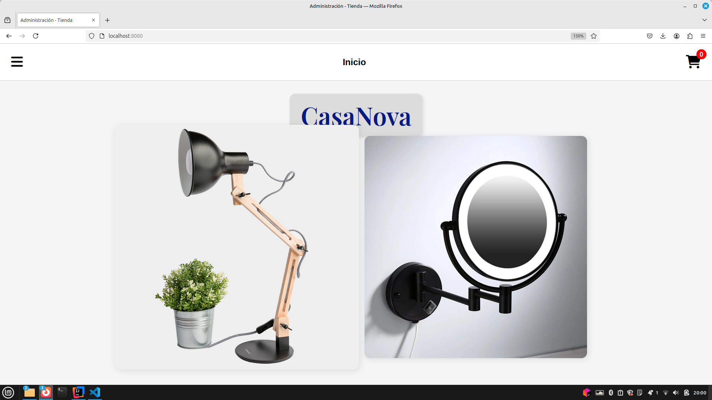
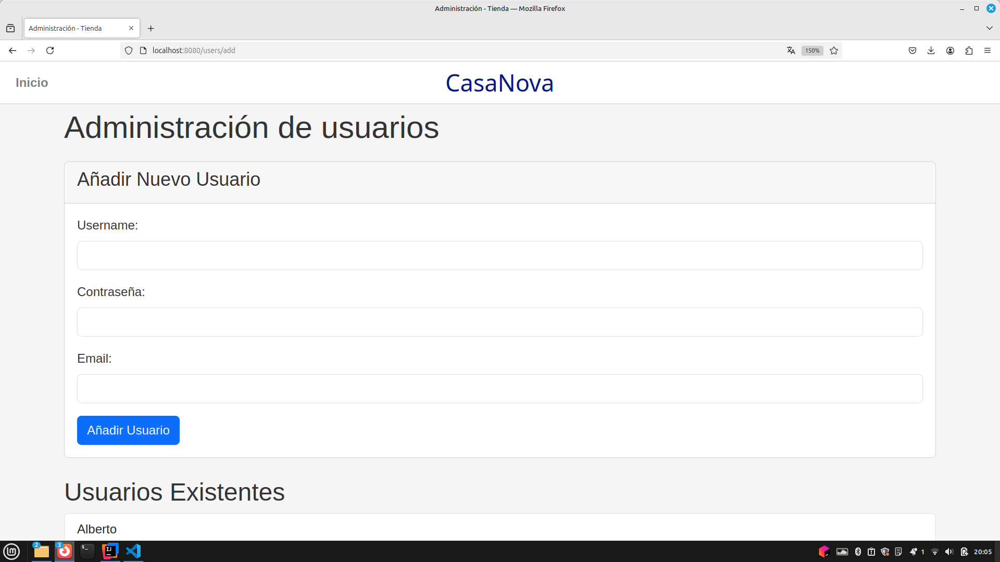
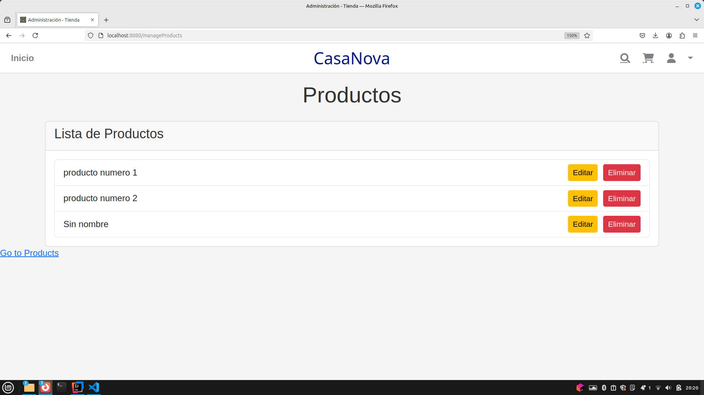
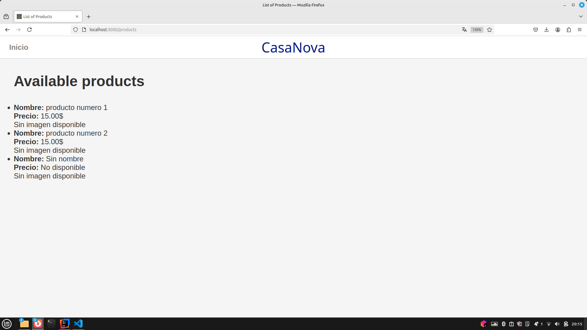
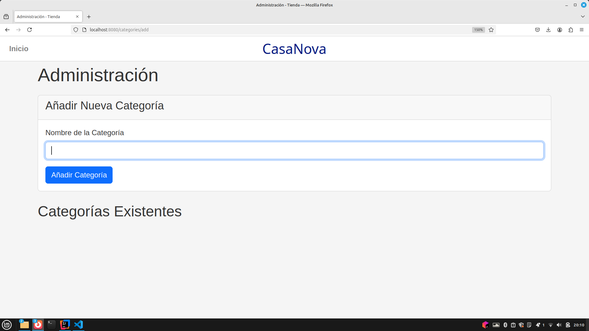

# Proyecto Sistemas Distribuidos 2024-2025

## Navegación

### Capturas de Pantalla
<!-- Añade aquí las capturas de pantalla de las páginas principales de la aplicación -->
1. **Página Principal**
   

2. **Administración de Usuarios**
   

3. **Administración de Productos**
   

4. **Añadir Producto**
   

5. **Lista de Productos**
   

6. **Añadir Categoría**
   


### Diagrama de Navegación
<!-- Añade aquí el diagrama de navegación de la aplicación -->


## Instrucciones de Ejecución

### Requisitos
- Java 17
- MySQL 8.0.32
- Maven 3.8.1

### Pasos para Descargar, Construir y Ejecutar la Aplicación

1. **Clonar el repositorio**:
   ```sh
   https://github.com/SSDD-2025/practica-sistemas-distribuidos-2025-grupo-10.git
   cd cd practica-sistemas-distribuidos-2025-grupo-10
   ```

2. **Configurar la base de datos MySQL**:
    - Crear una base de datos en MySQL:
      ```sql
      CREATE DATABASE your_database_name;
      ```
    - Actualizar las credenciales de la base de datos en `src/main/resources/application.properties`:
      ```properties
      spring.datasource.url=jdbc:mysql://localhost:3306/your_database_name
      spring.datasource.username=your_username
      spring.datasource.password=your_password
      ```

3. **Construir la aplicación**:
   ```sh
   mvn clean install
   ```

4. **Ejecutar la aplicación**:
   ```sh
   mvn spring-boot:run
   ```

## Diagrama UML de las Clases Java
<!-- Añade aquí el diagrama UML de las clases Java -->


## Diagrama de Clases y Templates

<!-- Añade aquí el diagrama de clases de la aplicación -->


## Información Adicional

### Estructura del Proyecto

#### Controladores
- **UserController**: Maneja las solicitudes relacionadas con los usuarios.
- **CategoryController**: Maneja las solicitudes relacionadas con las categorías.
- **OrderController**: Maneja las solicitudes relacionadas con los pedidos.
- **ProductController**: Maneja las solicitudes relacionadas con los productos.

#### Servicios
- **UserService**: Proporciona operaciones CRUD para los usuarios.
- **CategoryService**: Proporciona operaciones CRUD para las categorías.
- **OrderService**: Proporciona operaciones CRUD para los pedidos.
- **ProductService**: Proporciona operaciones CRUD para los productos.
- **SampleDataService**: Inicializa datos de muestra en la base de datos.

#### Repositorios
- **UserRepository**: Interfaz para las operaciones CRUD en la entidad `User`.
- **CategoryRepository**: Interfaz para las operaciones CRUD en la entidad `Category`.
- **OrderRepository**: Interfaz para las operaciones CRUD en la entidad `Order`.
- **ProductRepository**: Interfaz para las operaciones CRUD en la entidad `Product`.

#### Entidades
- **User**: Representa a un usuario en el sistema.
- **Category**: Representa una categoría de productos.
- **Order**: Representa un pedido realizado por un usuario.
- **Product**: Representa un producto en el sistema.

### Plantillas HTML
- **addCategory.html**: Formulario para añadir una nueva categoría.
- **addProduct.html**: Formulario para añadir un nuevo producto.
- **addUser.html**: Formulario para añadir un nuevo usuario.
- **editProduct.html**: Formulario para editar un producto existente.
- **error.html**: Página de error.
- **index.html**: Página principal.
- **mainPage.html**: Página principal de la aplicación.
- **manageProducts.html**: Página para gestionar productos.
- **products.html**: Muestra la lista de productos.
- **showProduct.html**: Muestra los detalles de un producto.
- **users.html**: Muestra la lista de usuarios.
### Configuración de la Base de Datos
- **application.properties**: Contiene la configuración de la base de datos MySQL.

```properties
spring.application.name=demo1
#Mustache configuration
spring.mustache.suffix=.html
spring.mustache.prefix=classpath:/templates/
#datasource configuration for MySQL
#spring.datasource.url=jdbc:mysql://localhost:3306/shop
#spring.datasource.username=root
#spring.datasource.password=password
#spring.datasource.driver-class-name=com.mysql.cj.jdbc.Driver
#JPA and hibernate configuration
#spring.jpa.database-platform=org.hibernate.dialect.MySQL8Dialect

# H2
spring.datasource.url=jdbc:h2:mem:testdb
spring.h2.console.enabled=true

spring.jpa.hibernate.ddl-auto=create-drop
spring.jpa.show-sql=true
spring.jpa.properties.hibernate.format_sql=true

spring.jpa.properties.hibernate.globally_quoted_identifiers=true

spring.servlet.multipart.max-file-size=10MB
spring.servlet.multipart.max-request-size=10MB


# SQL logging
logging.level.org.hibernate.SQL=DEBUG
logging.level.org.hibernate.type.descriptor.sql.BasicBinder=TRACE

```
