# Proyecto Sistemas Distribuidos 2024-2025

## Integrantes

| Nombre                     | Email                              | GitHub                                  |
|----------------------------|------------------------------------|-----------------------------------------|
| Javier Castellanos Serrano | j.castellanos.2018@alumnos.urjc.es | [GitHub](https://github.com/Javicastes) |
| María Martín Mullor        | m.martin.2021@alumnos.urjc.es      | [GitHub](https://github.com/maria-marmul) |
| Verónica Ramírez Marín     | v.ramirez.2021@alumnos.urjc.es     | [GitHub](https://github.com/VeroRam1)   |
| Wenhao Zhang               | w.zhang.2022@alumnos.urjc.es       | [GitHub](https://github.com/wenhiii)    |


## Navegación

### Capturas de Pantalla

1. **Página Principal**
- *Pantalla de presentación desde donde puede comenzar a navegar el usuario, haciendo click en las categorías para ver productos filtrados, pulsando en el carrito o en el desplegable*
   

2. **Administración de Usuarios**
- *Desde aquí podemos añadir o eliminar usuarios, y ver los usuarios existentes.*
   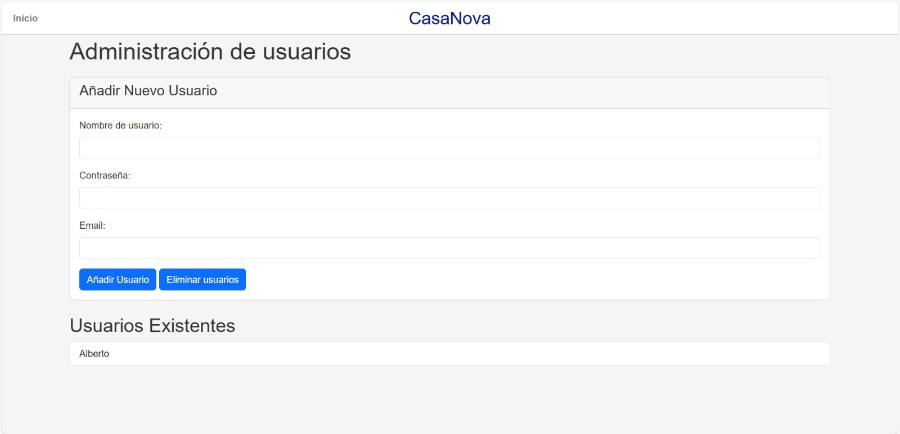

3. **Lista de Usuarios**
- *Página para ver la lista de usuarios, donde podremos eliminar a algún usuario de la lista o pulsar el botón de Añadir usuarios  para añadir uno nuevo.*
   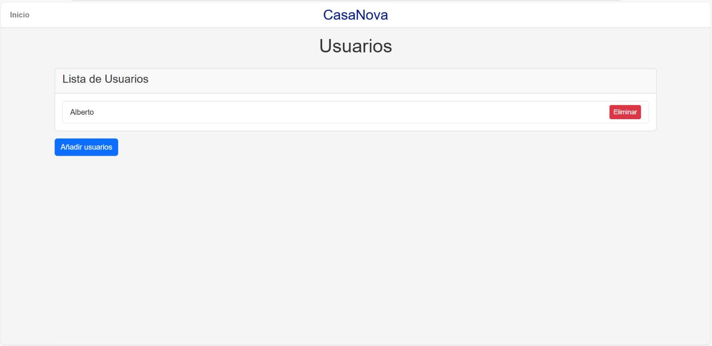

4. **Administración de Productos**
- *Aquí podemos añadir productos nuevos.*
   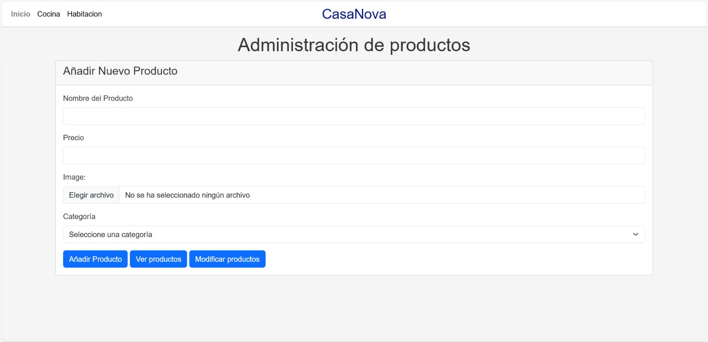

5. **Productos disponibles**
- *En esta página podemos ver los productos disponibles, que aparecen con una imagen, el nombre y el precio. Podemos añadirlos al carrito.*
   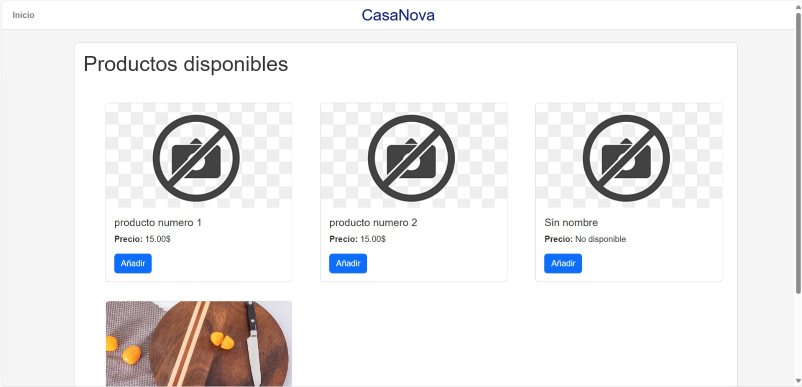

6. **Lista de Productos**
- *Página para ver la lista de productos de nuestra web, desde donde podremos modificarlos si nos interesa.*
   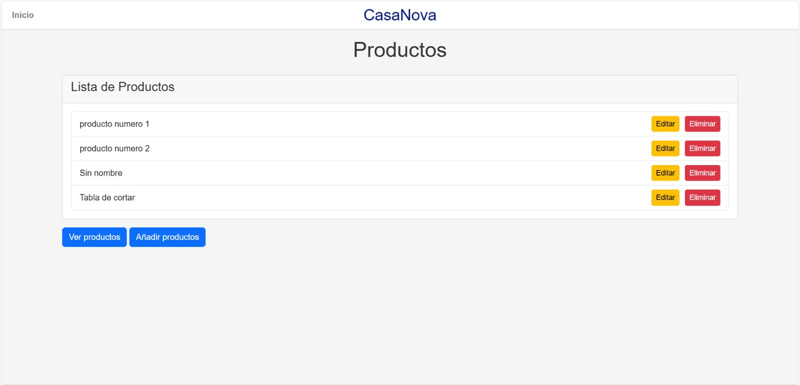

7. **Editar Productos**
- *Desde aquí podemos editar cualquier producto que queramos: su nombre, el precio y la categoría a la que pertenecen.*
   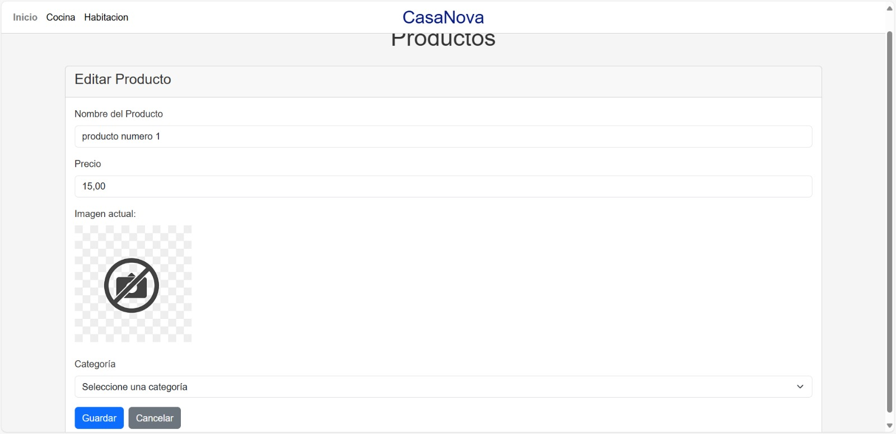

8. **Ver Productos en una Categoría**
- *Podemos ver los productos de cada categoría.*
   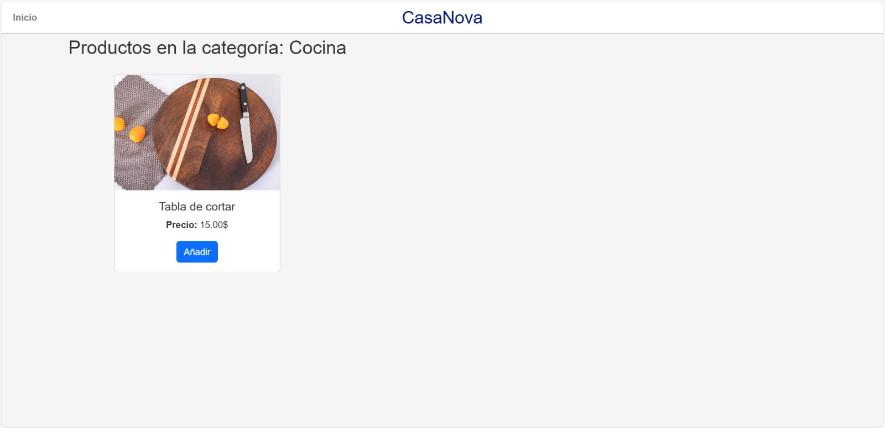

9. **Administración de Categorías**
- *Página para añadir categorías nuevas, desde donde también podemos ver o modificar las categorías existentes.*
   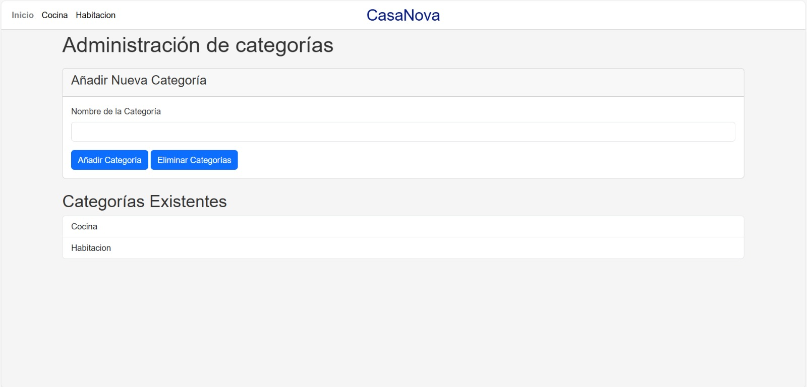

10. **Lista de Categorías**
- *Página para eliminar categorías.*
   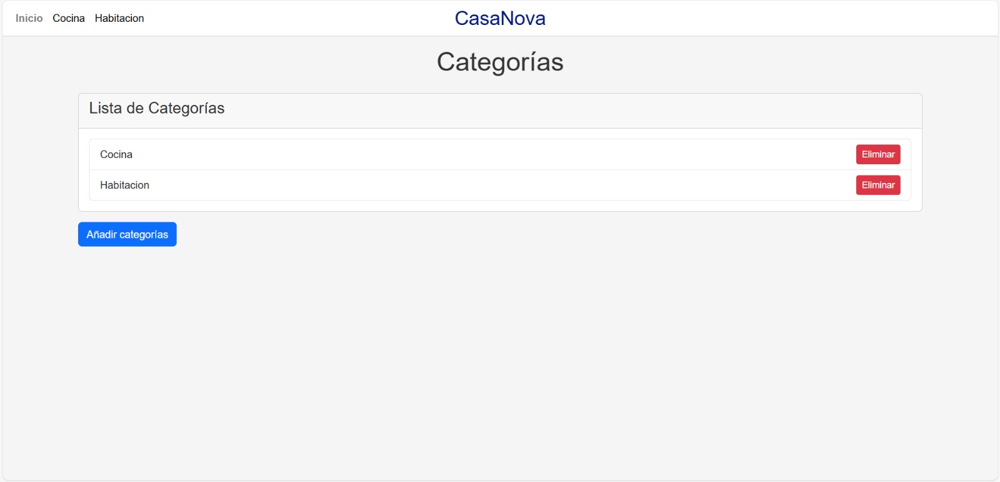

11. **Pedido**
- *En esta página podemos ver todos nuestros pedidos.*
   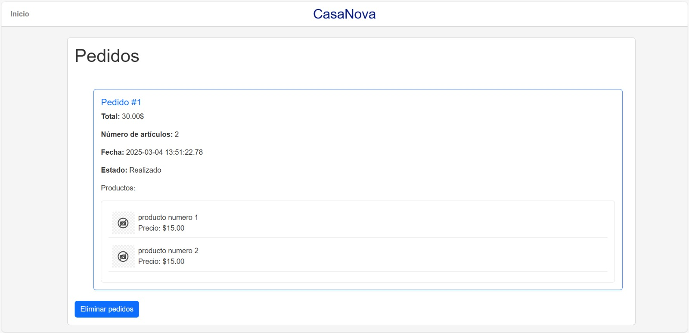

12. **Lista de Pedidos**
- *En esta página podemos eliminar nuestros pedidos.*
   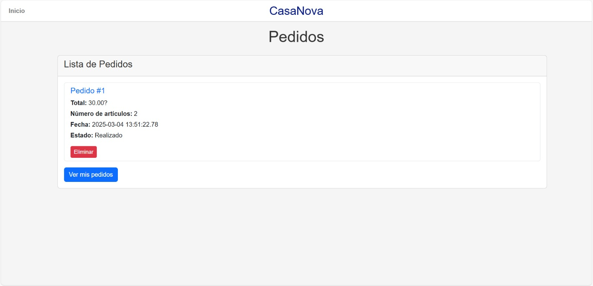

13. **Carrito**
- *Página del carrito de la compra, desde donde podremos finalizar la compra o seguir comprando.*
   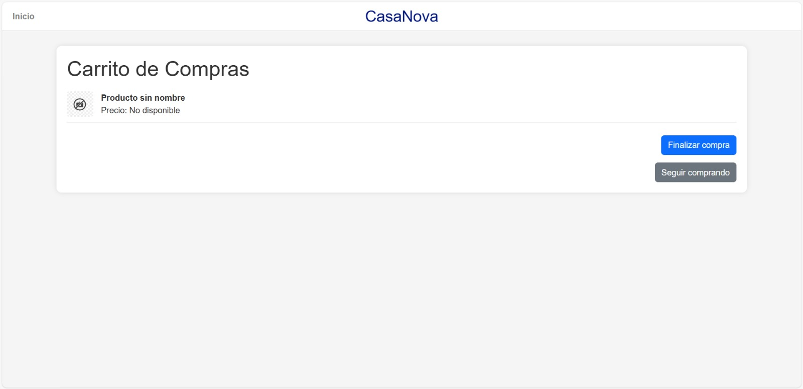

14. **Página de Error**
- *Página de error, al tratarse de una operación indebida o excepción*
    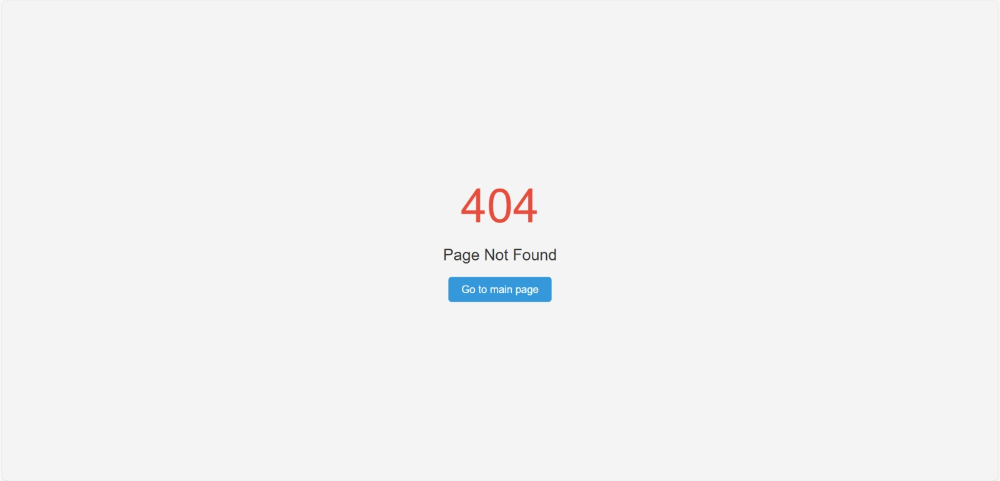

### Diagrama de Navegación

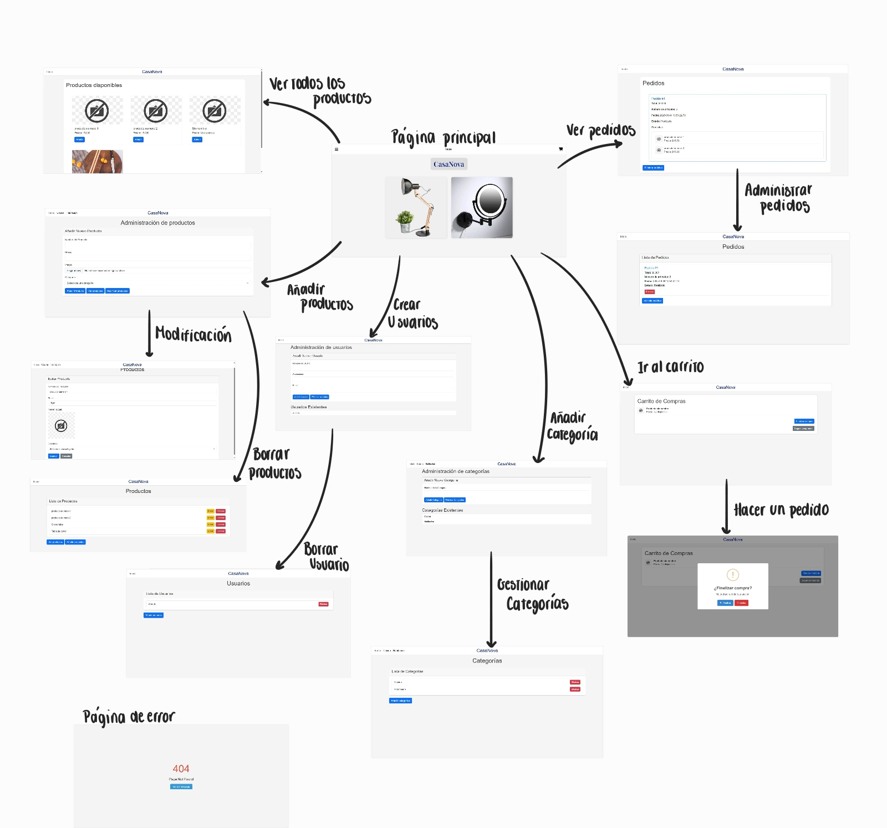

## Instrucciones de Ejecución

### Requisitos
- Java 17
- MySQL 8.0.32
- Maven 3.8.1

### Pasos para Descargar, Construir y Ejecutar la Aplicación

1. **Clonar el repositorio**:
   ```sh
   https://github.com/SSDD-2025/practica-sistemas-distribuidos-2025-grupo-10.git
   cd cd practica-sistemas-distribuidos-2025-grupo-10
   ```

2. **Configurar la base de datos MySQL**:
    - Crear una base de datos en MySQL:
      ```sql
      CREATE DATABASE shop;
      ```
    - Actualizar las credenciales de la base de datos en `src/main/resources/application.properties`:
      ```properties
      spring.datasource.url=jdbc:mysql://localhost:3306/shop
      # Tanto el usuario como la contraseña difiere según lo configurado en cada máquina
      spring.datasource.username=root
      spring.datasource.password=88888888
      ```

3. **Construir la aplicación**:
    - Descarga las dependencias necesarias (Asegúrese de tener MVN instalado).
   ```sh
   mvn clean install
   ```
    - En caso de IDEs como IntelliJ o Eclipse, resolverán las dependencias por sí solas a partir del pom.xml.

4. **Ejecutar la aplicación**:
    - Como altenativa puede ejecutar `Demo1Application.java`.
   ```sh
   mvn spring-boot:run
   ```

## Diagrama UML de las Clases Java

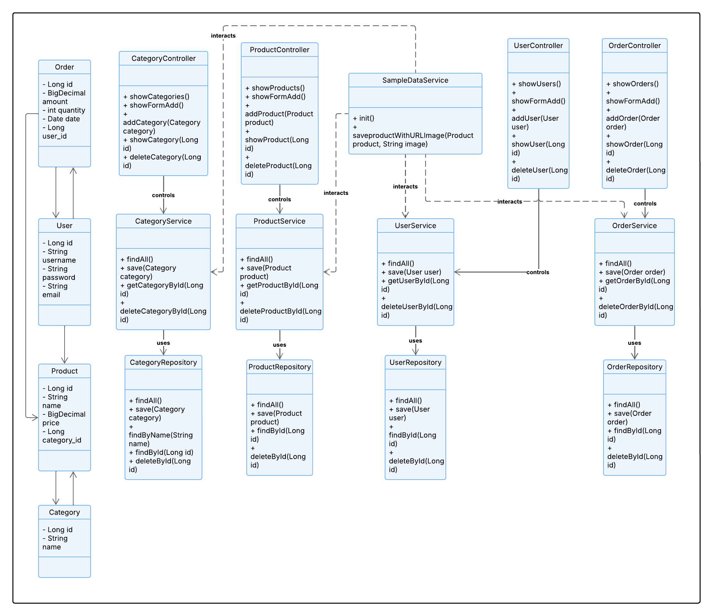

## Diagrama de Clases y Templates

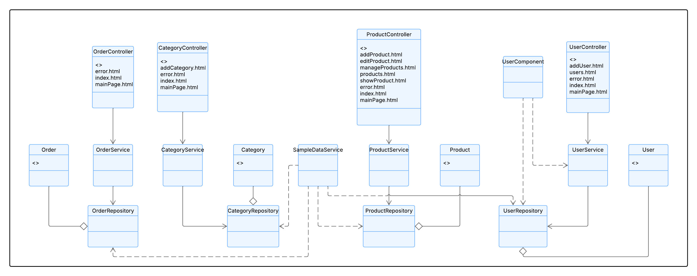


### Estructura del Proyecto

#### Controladores
- **UserController**: Maneja las solicitudes relacionadas con los usuarios.
- **CategoryController**: Maneja las solicitudes relacionadas con las categorías.
- **OrderController**: Maneja las solicitudes relacionadas con los pedidos.
- **ProductController**: Maneja las solicitudes relacionadas con los productos.

#### Servicios
- **UserService**: Proporciona operaciones CRUD para los usuarios.
- **CategoryService**: Proporciona operaciones CRUD para las categorías.
- **OrderService**: Proporciona operaciones CRUD para los pedidos.
- **ProductService**: Proporciona operaciones CRUD para los productos.
- **SampleDataService**: Inicializa datos de muestra en la base de datos.

#### Repositorios
- **UserRepository**: Interfaz para las operaciones CRUD en la entidad `User`.
- **CategoryRepository**: Interfaz para las operaciones CRUD en la entidad `Category`.
- **OrderRepository**: Interfaz para las operaciones CRUD en la entidad `Order`.
- **ProductRepository**: Interfaz para las operaciones CRUD en la entidad `Product`.

#### Entidades
- **User**: Representa a un usuario en el sistema.
- **Category**: Representa una categoría de productos.
- **Order**: Representa un pedido realizado por un usuario.
- **Product**: Representa un producto en el sistema.

#### Relaciones entre entidades
- Una categoría contiene **N** productos
- Un producto sólo pertenece a **1** categoría
- **N** usuarios puede tener **M** productos en el carrito
- Un usuario puede tener **N** pedidos
- Un pedido solo pertenece a **1** usuario
- **N** productos pertenecen a **M** pedidos

### Plantillas HTML
- **addCategory.html**: Formulario para añadir una nueva categoría.
- **addProduct.html**: Formulario para añadir un nuevo producto.
- **addUser.html**: Formulario para añadir un nuevo usuario.
- **editProduct.html**: Formulario para editar un producto existente.
- **error.html**: Página de error.
- **index.html**: Página principal.
- **mainPage.html**: Página principal de la aplicación.
- **manageProducts.html**: Página para gestionar productos.
- **products.html**: Muestra la lista de productos.
- **showProduct.html**: Muestra los detalles de un producto.

### Configuración de la Base de Datos
- **application.properties**: Contiene la configuración de la base de datos MySQL.

```properties
spring.application.name=demo1
#Mustache configuration
spring.mustache.suffix=.html
spring.mustache.prefix=classpath:/templates/
#datasource configuration for MySQL
spring.datasource.url=jdbc:mysql://localhost:3306/shop
spring.datasource.username=root
#Password depends on your personal computer database configuration
spring.datasource.password=88888888
spring.datasource.driver-class-name=com.mysql.cj.jdbc.Driver
JPA and hibernate configuration
spring.jpa.database-platform=org.hibernate.dialect.MySQL8Dialect

# H2
#spring.datasource.url=jdbc:h2:mem:testdb
#spring.h2.console.enabled=true

spring.jpa.hibernate.ddl-auto=update
spring.jpa.show-sql=true
spring.jpa.properties.hibernate.format_sql=true

spring.jpa.properties.hibernate.globally_quoted_identifiers=true

spring.servlet.multipart.max-file-size=10MB
spring.servlet.multipart.max-request-size=10MB


# SQL logging
logging.level.org.hibernate.SQL=DEBUG
logging.level.org.hibernate.type.descriptor.sql.BasicBinder=TRACE

```

## Participación

### Javier Castellanos 
- **Tareas**: Colaboración en el desarrollo del UserController para gestionar usuarios mediante operaciones CRUD. Incorporación de una ruta GET en el UserController para servir la vista addUser.html, facilitando la incorporación de nuevos usuarios al sistema. Implementación de los métodos save en UserService y CategoryService para garantizar la persistencia de los datos en la base de datos. Realización del README.md.
- **5 commits más significativos**:
   1. [Commit 1](https://github.com/SSDD-2025/practica-sistemas-distribuidos-2025-grupo-10/commit/5dd21b20343fcaf1e37d8f953e5b0f0642a57fc4)
   2. [Commit 2](https://github.com/SSDD-2025/practica-sistemas-distribuidos-2025-grupo-10/commit/7181af3d1441ab48e07ea2f7473e2bb9bb2ff741)
   3. [Commit 3](https://github.com/SSDD-2025/practica-sistemas-distribuidos-2025-grupo-10/commit/c55777c00e9cce2239ceb8e2f7a01adb5b7fe878)
   4. [Commit 4](https://github.com/SSDD-2025/practica-sistemas-distribuidos-2025-grupo-10/commit/825148a8159113f8ec795c44e53a12dbd9f36190)
   5. [Commit 5](https://github.com/SSDD-2025/practica-sistemas-distribuidos-2025-grupo-10/commit/7cdcea4476c5ab38c69e8b7be0a8ab25023b5762)
- **Ficheros más importantes**:
    1. https://github.com/SSDD-2025/practica-sistemas-distribuidos-2025-grupo-10/blame/main/README.md

### María Martín
- **Tareas**: Creación, edición y eliminación de productos. Creación y eliminación de categorías. Desarrollo de la página principal (MainPage). Creación del carrito de la compra. Eliminación de pedidos y usuarios. Adaptación y edición de todos los controllers para conectar correctamente con los nuevos HTML creados. Mejora de la presentación de las páginas HTML para hacerlas más visuales y fáciles de usar. Participación en la creación del Product Model, Product Service y Product Controller.
- **5 commits más significativos**:
   1. [Commit 1](https://github.com/SSDD-2025/practica-sistemas-distribuidos-2025-grupo-10/commit/843bb3a20fe8e3c6a407e71b6e006c8735851364)
   2. [Commit 2](https://github.com/SSDD-2025/practica-sistemas-distribuidos-2025-grupo-10/commit/5307457bd5a9859fb8daecd9cd36fb1567ab1eb6)
   3. [Commit 3](https://github.com/SSDD-2025/practica-sistemas-distribuidos-2025-grupo-10/commit/a82227cde0b2736ae7fb5f365961c2225888ded5)
   4. [Commit 4](https://github.com/SSDD-2025/practica-sistemas-distribuidos-2025-grupo-10/commit/72dc52a7e6eea2683c48e8e659b08ba5e055b5ff)
   5. [Commit 5](https://github.com/SSDD-2025/practica-sistemas-distribuidos-2025-grupo-10/commit/843bb3a20fe8e3c6a407e71b6e006c8735851364)
- **Ficheros más importantes**:
     1. https://github.com/SSDD-2025/practica-sistemas-distribuidos-2025-grupo-10/blame/main/src/main/resources/templates/addCategory.html

### Verónica Ramírez
- **Tareas**: Esquema inicial, controllers y services de algunas de las entidades, junto con Wenhao relaciones entre entidades, parte de la visualización de pedido, carrito y productos y página de error.
- **5 commits más significativos**:
   1. [Commit 1](https://github.com/SSDD-2025/practica-sistemas-distribuidos-2025-grupo-10/commit/4bd30f19b6619d075d6da5987a40e3d93e62afaf)
   2. [Commit 2](https://github.com/SSDD-2025/practica-sistemas-distribuidos-2025-grupo-10/commit/ff11e368a3839381852616fb136f4f67a4628481)
   3. [Commit 3](https://github.com/SSDD-2025/practica-sistemas-distribuidos-2025-grupo-10/commit/30adb43bc690644fa6daa0e76b8cc65662553e14)
   4. [Commit 4](https://github.com/SSDD-2025/practica-sistemas-distribuidos-2025-grupo-10/commit/2f267fbdc681a344dd2a5cd869b8217f3459cc8b)
   5. [Commit 5](https://github.com/SSDD-2025/practica-sistemas-distribuidos-2025-grupo-10/commit/1a6b5b713c3ce116bc4105c6dafce95179f3381e)
- **Ficheros más importantes**:
     1. https://github.com/SSDD-2025/practica-sistemas-distribuidos-2025-grupo-10/blame/main/src/main/resources/templates/orders.html

### Wenhao Zhang
- **Tarea**: Implementación de los métodos básicos de las entidades (como clases de Java), implementación de las relaciones de la BBDD. Testeo de las operaciones de guardado, testeo de las operaciones de borrado y testeo de las operaciones de modificación o actualización junto a Vero. Implementación de la visualización de productos por categoría junto a Vero.
- **5 commits más significativos**:
   1. [Commit 1](https://github.com/SSDD-2025/practica-sistemas-distribuidos-2025-grupo-10/commit/1ef9813341453f52d092a74f7f8a57ce231c92db)
   2. [Commit 2](https://github.com/SSDD-2025/practica-sistemas-distribuidos-2025-grupo-10/commit/76aba34e88dd7d574523e527003b28e050e339a5)
   3. [Commit 3](https://github.com/SSDD-2025/practica-sistemas-distribuidos-2025-grupo-10/commit/57c5923e7fe2de489ce51931316ebccaf73bf933)
   4. [Commit 4](https://github.com/SSDD-2025/practica-sistemas-distribuidos-2025-grupo-10/commit/1a6b5b713c3ce116bc4105c6dafce95179f3381e )
   5. [Commit 5](https://github.com/SSDD-2025/practica-sistemas-distribuidos-2025-grupo-10/commit/825148a8159113f8ec795c44e53a12dbd9f36190)
- **Ficheros más importantes**:
     1. https://github.com/SSDD-2025/practica-sistemas-distribuidos-2025-grupo-10/blob/main/src/main/java/com/example/demo/service/UserService.java
